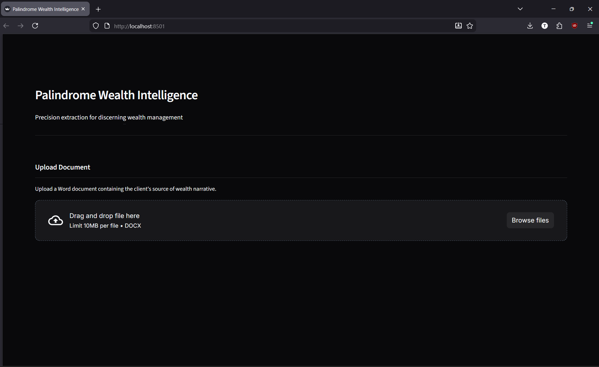
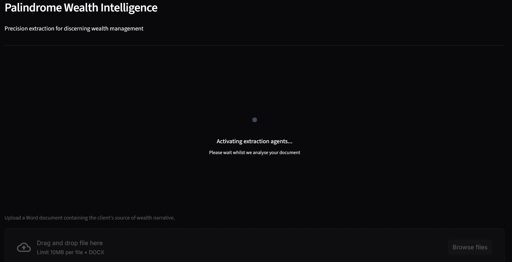
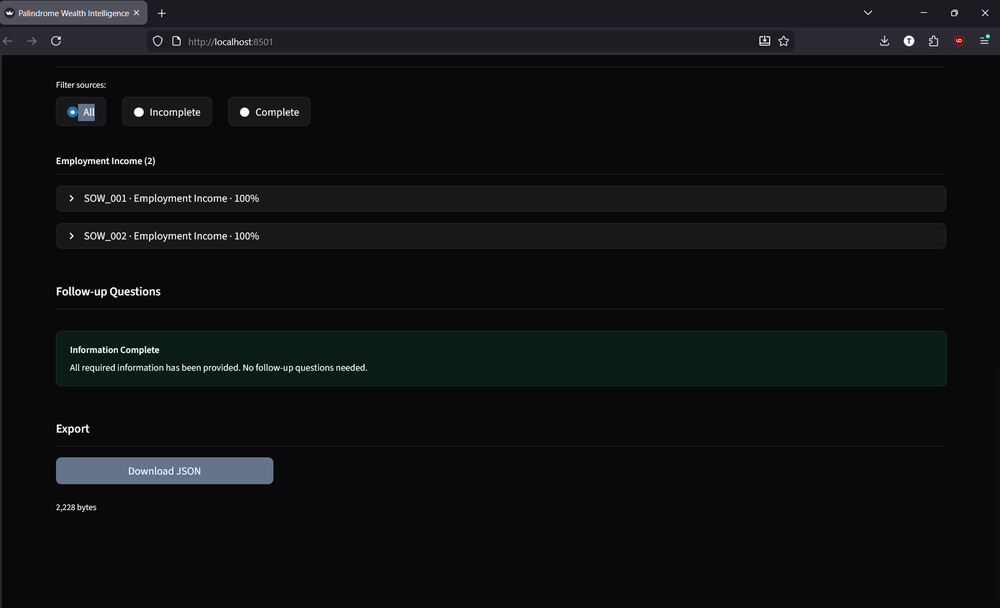
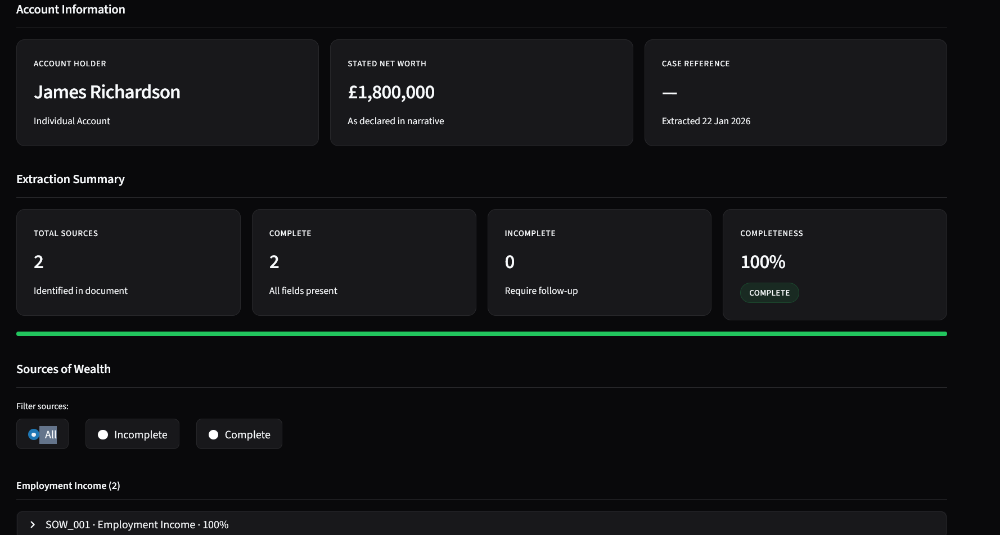

# Source of Wealth Extraction System

AI-powered system to extract structured Source of Wealth (SOW) information from unstructured client narratives for KYC/AML compliance.

## Features

- **Multi-Agent Extraction**: 11 specialised agents for different wealth source types
- **Validation Pipeline**: Re-extraction with high reasoning effort for flagged fields
- **Completeness Scoring**: Per-source and overall completeness metrics
- **Missing Field Detection**: Identifies gaps and generates contextual follow-up questions
- **Overlapping Source Detection**: Links related sources from the same event
- **LLM-Based Evaluation**: Semantic field comparison for accurate accuracy measurement
- **Web UI**: Streamlit interface for document upload and results visualisation
- **JSON Export**: Structured output for compliance system integration

## Setup

### Requirements

- Python 3.12+
- OpenAI API key

### Installation

1. Clone the repository:
```bash
git clone <repository-url>
cd genai-assignment-palindrome
```

2. Create and activate virtual environment:
```bash
python -m venv .venv
.venv\Scripts\activate  # Windows
source .venv/bin/activate  # Linux/Mac
```

3. Install dependencies:
```bash
pip install -r requirements.txt
```

4. Set up environment variables:
```bash
# Windows PowerShell
$env:OPENAI_API_KEY="your_api_key_here"

# Linux/Mac
export OPENAI_API_KEY=your_api_key_here
```

## Usage

### Web Application (Recommended)

Run the Streamlit web application:
```bash
streamlit run app.py
```

Then open your browser to `http://localhost:8501` and:
1. Upload a .docx file containing a client narrative - will auto process
2. Review the extracted data, completeness scores, and follow-up questions
3. Download the JSON output if needed

### Batch Extraction & Evaluation

Run extraction on test cases with comparison reports:
```bash
# Run all cases with LLM semantic evaluation (recommended for accurate metrics)
python run_extraction.py --llm-eval

# Run specific cases
python run_extraction.py --cases case_01 case_02 --llm-eval

# Training data only
python run_extraction.py --training-only --llm-eval

# Holdout data only
python run_extraction.py --holdout-only --llm-eval
```

> **Note**: The `--llm-eval` flag enables LLM-based semantic comparison for field accuracy. Without it, only strict string matching is used, which underreports accuracy for free-text fields where formatting differs but meaning is equivalent.

Results are saved to `extraction_runs/<timestamp>/` including:
- Individual case JSON outputs
- `comparison_report.md` with accuracy metrics by source type
- `run_summary.json` with aggregate statistics

### Running Tests

Run deterministic tests (fast, no API calls):
```bash
pytest tests/ -v
```

Run LLM integration tests (requires API key) - expect non-determisitic results:
```bash
pytest tests/llm_tests/ -v
```

## Evaluation Results

The system achieves **93.9% field accuracy** across all 15 test cases (10 training + 5 holdout), correctly identifying **97.7% of expected sources**. LLM-based semantic matching (enabled via `--llm-eval`, requires `OPENAI_API_KEY`) corrected 34 fields that were marked wrong by strict string matching but were semantically equivalent.

| Dataset | Cases | Field Accuracy | Source Match | Avg Time |
|---------|-------|----------------|--------------|----------|
| Training (01-10) | 10 | 95.2% | 98.1% | 18.6s |
| Holdout (11-15) | 5 | 91.4% | 96.8% | 28.2s |

**Strong performers**: Inheritance (100%), sale_of_business (100%), divorce_settlement (100%), insurance_payout (100%)

**Areas for improvement**: Business income (67%) struggles with implicit ownership vs employment distinction; employment_income (88%) occasionally misses country inference or over-extracts contextual mentions.

## Architecture

The system uses a multi-agent architecture with specialised extraction agents coordinated by an orchestrator.

```
┌─────────────────────────────────────────────────────────────────────────────────┐
│                              Streamlit UI (app.py)                              │
│           Upload .docx → Display Results → Export JSON                          │
└─────────────────────────────────────────────────────────────────────────────────┘
                                        │
                                        ▼
┌─────────────────────────────────────────────────────────────────────────────────┐
│                         Document Loader                                         │
│              Parse .docx → Extract plain text narrative                         │
└─────────────────────────────────────────────────────────────────────────────────┘
                                        │
                                        ▼
┌─────────────────────────────────────────────────────────────────────────────────┐
│                              ORCHESTRATOR                                       │
│                                                                                 │
│  ┌─────────────────────────────────────────────────────────────────────────┐   │
│  │ PHASE 1: Metadata Extraction                                            │   │
│  │   Extract account holder name, type (individual/joint), net worth       │   │
│  └─────────────────────────────────────────────────────────────────────────┘   │
│                                        │                                        │
│                                        ▼                                        │
│  ┌─────────────────────────────────────────────────────────────────────────┐   │
│  │ PHASE 2: Parallel Agent Dispatch (11 Specialised Agents)                │   │
│  │                                                                         │   │
│  │   ┌──────────────┐ ┌──────────────┐ ┌──────────────┐ ┌──────────────┐  │   │
│  │   │ Employment   │ │ Property     │ │ Business     │ │ Business     │  │   │
│  │   │ Agent        │ │ Sale Agent   │ │ Income Agent │ │ Dividends    │  │   │
│  │   └──────────────┘ └──────────────┘ └──────────────┘ └──────────────┘  │   │
│  │   ┌──────────────┐ ┌──────────────┐ ┌──────────────┐ ┌──────────────┐  │   │
│  │   │ Business     │ │ Asset Sale   │ │ Inheritance  │ │ Gift         │  │   │
│  │   │ Sale Agent   │ │ Agent        │ │ Agent        │ │ Agent        │  │   │
│  │   └──────────────┘ └──────────────┘ └──────────────┘ └──────────────┘  │   │
│  │   ┌──────────────┐ ┌──────────────┐ ┌──────────────┐                   │   │
│  │   │ Divorce      │ │ Lottery      │ │ Insurance    │                   │   │
│  │   │ Agent        │ │ Agent        │ │ Agent        │                   │   │
│  │   └──────────────┘ └──────────────┘ └──────────────┘                   │   │
│  │                                                                         │   │
│  │   Each agent extracts sources of its type (returns [] if none found)   │   │
│  └─────────────────────────────────────────────────────────────────────────┘   │
│                                        │                                        │
│                                        ▼                                        │
│  ┌─────────────────────────────────────────────────────────────────────────┐   │
│  │ PHASE 3: Results Aggregation                                            │   │
│  │   • Merge all agent outputs                                             │   │
│  │   • Assign source IDs (SOW_001, SOW_002, ...)                           │   │
│  │   • Detect joint account attribution                                    │   │
│  │   • Link related/overlapping sources                                    │   │
│  │   • Deduplicate similar entries                                         │   │
│  └─────────────────────────────────────────────────────────────────────────┘   │
│                                        │                                        │
│                                        ▼                                        │
│  ┌─────────────────────────────────────────────────────────────────────────┐   │
│  │ PHASE 4: Field Search Agent (Tool-based search for missing fields)     │   │
│  │   • Identifies fields marked as missing/null                            │   │
│  │   • Uses ReAct pattern with deterministic search tools:                 │   │
│  │     - search_exact: Find exact string matches                           │   │
│  │     - search_regex: Pattern-based search (dates, amounts)               │   │
│  │     - search_context: Semantic paragraph search                         │   │
│  │     - search_entities: Find named entities (people, companies)          │   │
│  │     - verify_quote: Confirm text exists in narrative                    │   │
│  │   • Up to 5 tool calls per field (bounded execution)                    │   │
│  │   • Returns evidence trail for explainability                           │   │
│  └─────────────────────────────────────────────────────────────────────────┘   │
│                                        │                                        │
│                                        ▼                                        │
│  ┌─────────────────────────────────────────────────────────────────────────┐   │
│  │ PHASE 5: Validation Agent (High Reasoning Effort Re-extraction)         │   │
│  │   • Reviews sources with issues (missing fields, low completeness)      │   │
│  │   • Uses o3-mini with high reasoning effort for deep analysis           │   │
│  │   • Injects field-specific format criteria from original prompts        │   │
│  │   • Corrects extraction errors and fills additional fields              │   │
│  └─────────────────────────────────────────────────────────────────────────┘   │
│                                        │                                        │
│                                        ▼                                        │
│  ┌─────────────────────────────────────────────────────────────────────────┐   │
│  │ PHASE 6: Completeness Scoring                                           │   │
│  │   • Calculate per-source completeness (populated / required fields)     │   │
│  │   • Calculate overall completeness score                                │   │
│  │   • Flag sources with missing critical fields                           │   │
│  └─────────────────────────────────────────────────────────────────────────┘   │
│                                        │                                        │
│                                        ▼                                        │
│  ┌─────────────────────────────────────────────────────────────────────────┐   │
│  │ PHASE 7: Follow-up Question Generation                                  │   │
│  │   • Analyses missing fields and their context                           │   │
│  │   • Generates natural, contextual questions                             │   │
│  │   • Prioritises by compliance importance                                │   │
│  └─────────────────────────────────────────────────────────────────────────┘   │
│                                        │                                        │
└────────────────────────────────────────┼────────────────────────────────────────┘
                                         │
                                         ▼
┌─────────────────────────────────────────────────────────────────────────────────┐
│                            ExtractionResult JSON                                │
│   • metadata (account holder, net worth, currency)                              │
│   • sources_of_wealth[] (extracted fields, missing fields, completeness)        │
│   • summary (total sources, completeness stats)                                 │
│   • recommended_follow_up_questions[]                                           │
└─────────────────────────────────────────────────────────────────────────────────┘
```

### Key Design Decisions

1. **Run All Agents, Don't Pre-Filter**: The orchestrator dispatches all 11 agents in parallel rather than trying to predict which source types are present. This ensures implicit mentions aren't missed.

2. **Two-Pass Extraction**: Initial extraction followed by validation agent re-extraction for flagged fields ensures higher accuracy on complex cases.

3. **Reasoning Model for Validation**: The validation agent uses `o3-mini` with high reasoning effort to handle edge cases and complex field relationships that simpler models miss.

4. **Context-Aware Extraction**: Each agent receives account holder context to correctly attribute sources in joint account scenarios.

5. **Graceful Degradation**: If any single agent fails, the system continues with partial results rather than failing entirely.

## Project Structure

```
.
├── app.py                    # Streamlit web application entry point
├── run_extraction.py         # Batch extraction and evaluation script
├── src/
│   ├── agents/
│   │   ├── orchestrator.py   # Main coordination logic
│   │   ├── metadata_agent.py # Account holder extraction
│   │   ├── validation_agent.py # High-effort re-extraction
│   │   ├── field_search_agent.py # Targeted field search
│   │   ├── followup_agent.py # Question generation
│   │   ├── base.py           # Base agent class with retry logic
│   │   ├── sow/              # 11 specialised extraction agents
│   │   │   ├── employment_agent.py
│   │   │   ├── property_agent.py
│   │   │   ├── gift_agent.py
│   │   │   ├── inheritance_agent.py
│   │   │   └── ... (7 more)
│   │   └── prompts/          # Agent instruction templates
│   ├── models/
│   │   └── schemas.py        # Pydantic models for all data types
│   ├── loaders/
│   │   └── document_loader.py # .docx parsing
│   ├── knowledge/
│   │   └── sow_knowledge.py  # Field requirements per source type
│   ├── config/
│   │   ├── settings.py       # Environment configuration
│   │   └── agent_configs.py  # Model and parameter settings
│   └── utils/
│       ├── logging_config.py # Logging setup
│       ├── deduplication.py  # Source merging logic
│       ├── sow_utils.py      # SOW processing utilities
│       └── validation.py     # Field validation helpers
├── tests/                    # Deterministic unit tests
├── tests/llm_tests/          # LLM integration tests
├── training_data/            # 10 cases with expected outputs
├── holdout_data/             # 5 evaluation cases
├── knowledge_base/           # SOW requirements JSON
└── extraction_runs/          # Saved extraction results
```

## Output Format

The system produces structured JSON output:

```json
{
  "metadata": {
    "case_id": "case_01",
    "account_holder": {
      "name": "John Smith",
      "type": "individual"
    },
    "total_stated_net_worth": 500000,
    "currency": "GBP"
  },
  "sources_of_wealth": [
    {
      "source_type": "employment_income",
      "source_id": "SOW_001",
      "description": "Current employment at Meridian Capital",
      "extracted_fields": {
        "employer_name": "Meridian Capital Partners LLP",
        "job_title": "Senior Portfolio Manager",
        "annual_income": "£185,000",
        "employment_start_date": "March 2018"
      },
      "missing_fields": [],
      "completeness_score": 1.0
    }
  ],
  "summary": {
    "total_sources_identified": 2,
    "fully_complete_sources": 2,
    "sources_with_missing_fields": 0,
    "overall_completeness_score": 0.95
  },
  "recommended_follow_up_questions": []
}
```

## Prompt Engineering Strategy

### Agent Instructions
- Each agent has specialised instructions loaded from `src/agents/prompts/`
- Instructions emphasise extracting **only explicitly stated information** - never inferring
- Field format criteria are injected dynamically for validation re-extraction
- Examples of good vs bad extractions guide the model

### Validation Strategy
- Sources with missing required fields or low completeness are flagged
- Validation agent uses high reasoning effort (`o3-mini`) for deep analysis
- Original field formatting guidelines are preserved during re-extraction

### Follow-up Questions
- Questions are generated from missing field context
- Templates ensure natural, empathetic phrasing
- Sensitive topics (inheritance, divorce) handled appropriately

## Known Limitations

1. **Chain Depth**: Source chains (e.g., gift → inheritance → business sale) are traced to 2 levels maximum
2. **Currency Conversion**: Original currencies are preserved; GBP conversions noted where stated but not calculated
3. **Vague Narratives**: Extremely vague inputs result in low completeness scores and many follow-up questions rather than hallucinated data
4. **Rate Limits**: Parallel agent dispatch may hit API rate limits on large batches; retry logic handles this but slows processing

## TODO

### Accuracy Improvements
- [ ] **Business Income Prompt Tuning**: Improve distinction between employment at a company vs. ownership/partnership income (remove incorrect rules e.g. .inc --> america)
- [ ] **Employment Country Inference**: Refine validation agent logic for when to infer country from context vs. mark as not stated  
- [ ] **Field Search Tool Enhancement**: Add targeted search patterns for commonly missed fields (dates, ownership percentages)
- [ ] **Reduce Hallucinated Sources**: Tighten prompts to avoid extracting implied/contextual sources as distinct entries

### Features
- [ ] **LLM Response Caching**: Cache responses keyed by narrative hash to reduce API costs on repeated extractions
- [ ] **Confidence Scores**: Per-field confidence from the LLM to indicate extraction certainty
- [ ] **Batch Processing UI**: Support uploading multiple documents in the Streamlit interface
- [ ] **Comparison View**: Side-by-side display of input narrative and extracted data with highlighting
- [ ] **Containerisation**: Dockerfile for easy deployment
- [ ] **Semantic Adequacy Validation**: Flag fields where the answer doesn't adequately explain the wealth (e.g., "teacher" for £680k)

### Ground Truth Data
- [ ] **Review case_07_multiple_sources_hnw**: Training data has Managing Director and Associate as the same employment - likely should be treated as separate

### Testing
- [ ] **Add determinsitic tests for all agent**: Currently just employment agent
- [ ] **Review llm_tests/ fit for use case**: Due to costs of running llm_tests/ has not been thoroughly reviewed.

## Development

### Testing (Integrated into Github actions pipeline - exlcuding llm_tests/)
```bash
pytest tests/
```

### Linting
```bash
ruff check src/ tests/
```

### Formatting
```bash
ruff format src/ tests/
```

### Type Checking
```bash
mypy src/
```

## Screenshots

### Home Screen


### Loading Screen


### Processed Results





